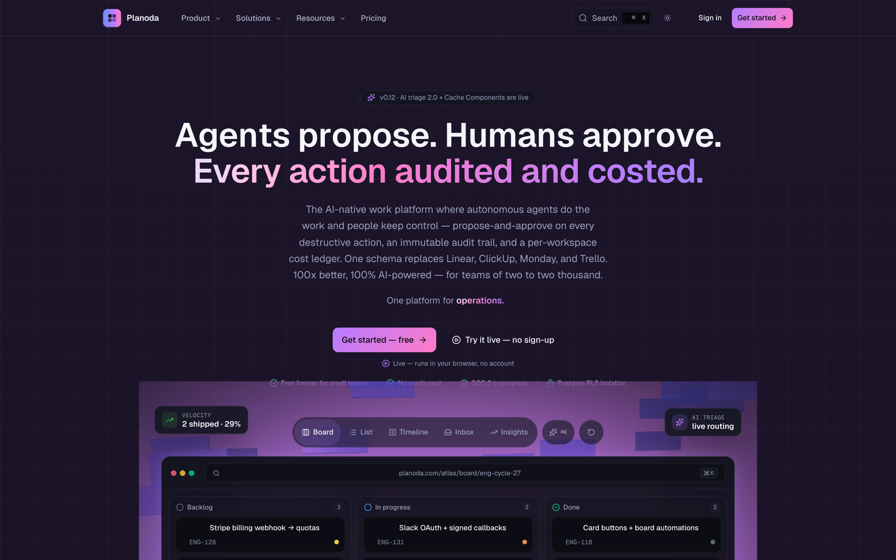
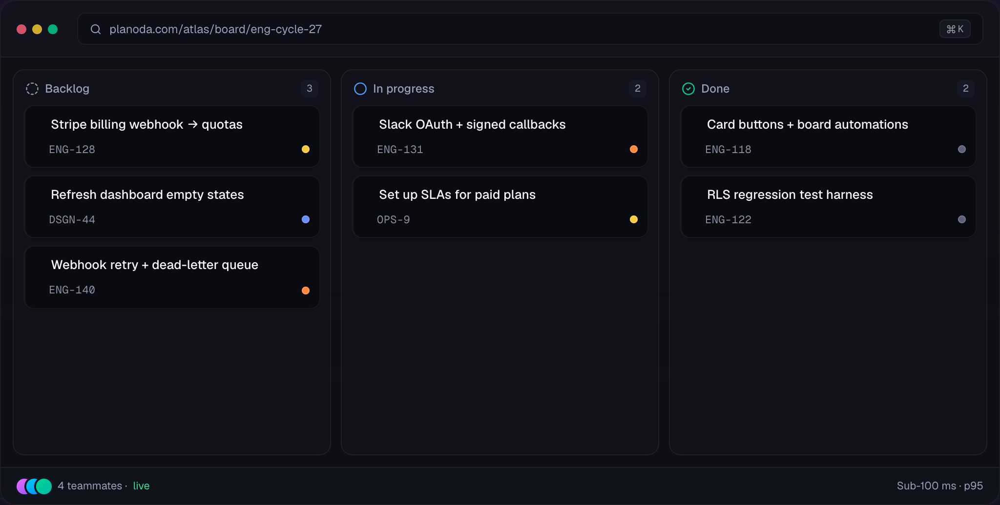
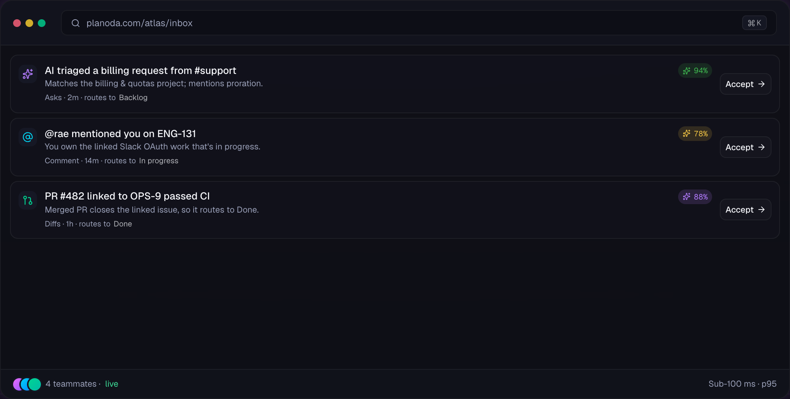
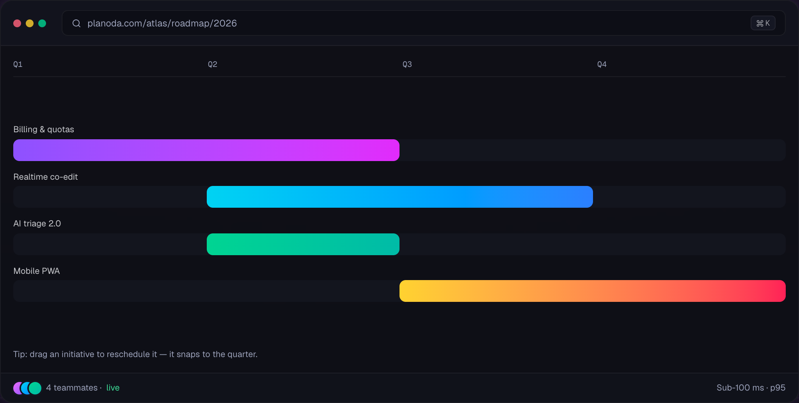
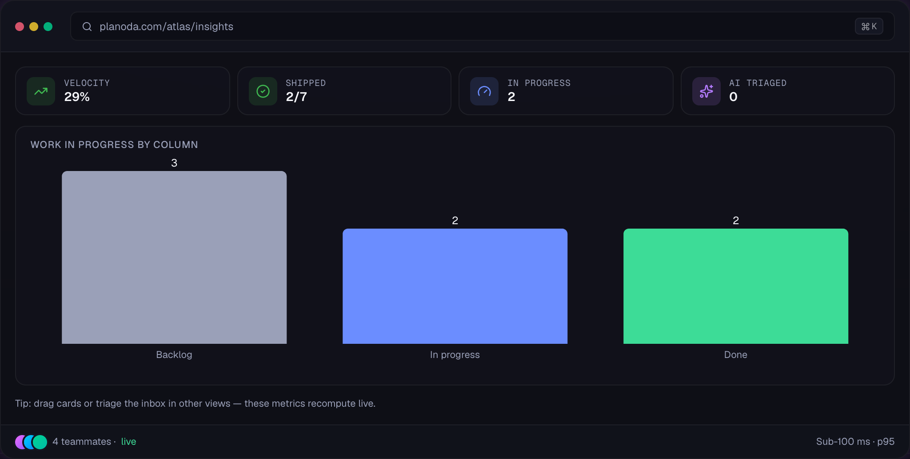
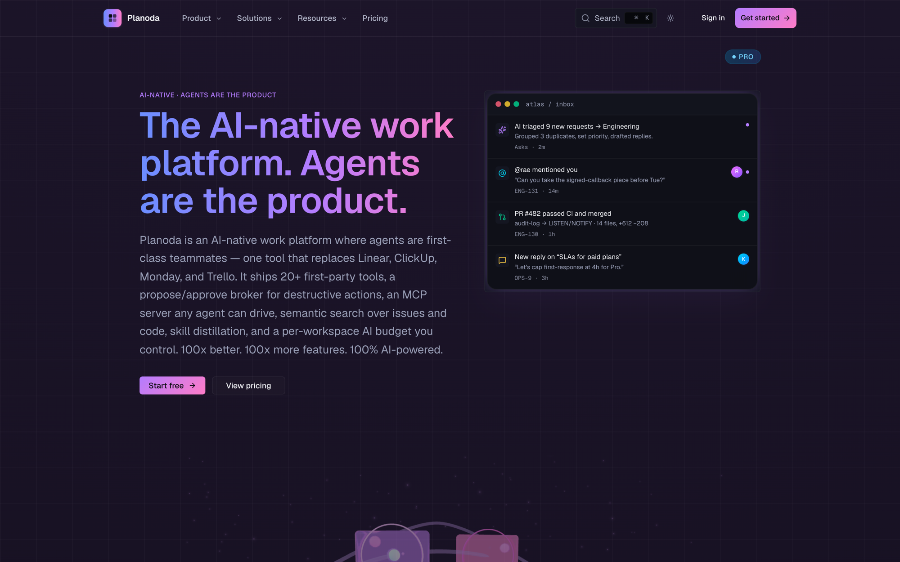

# Planoda

### The AI-native work platform that replaces Linear, ClickUp, Monday and Trello

Issues, boards, roadmaps and automations on **one schema** — with AI agents that _propose_ the work and humans who approve it.

🟢 v0.12 · pre-launch and shipping · GDPR with EU residency · SOC 2 Type II in progress

---

## Why Planoda exists

Most teams run a tracker, a whiteboard, a roadmap tool and a pile of automations — four data models that never quite agree, glued together by exports and syncing. Planoda puts all of it on a **single schema**, then adds AI that behaves the way you'd actually let it near production work: it drafts and proposes, and a human approves.

- 🧩 **One schema.** The board view and the keyboard-first issue tracker read the exact same data. No exporting, no syncing.
- 🤖 **Agents propose, you approve.** AI triages incoming requests from Slack, email and forms, then stops. A propose/approve broker guards every destructive action.
- 🛡️ **Governance is not an add-on.** Immutable, hash-chained audit log with actor, IP, target and before/after diff — streamable to your SIEM. Per-workspace AI cost ledger. HMAC-signed webhooks.
- ⚡ **Fast and realtime.** Sub-100 ms p95 interactions, realtime co-editing, full keyboard navigation.
- 🔒 **Tenant isolation in the database, not the app.** Every query runs inside a session-pinned transaction guarded by Postgres Row-Level Security.

---

## See it

Everything below is the real product surface — drive it yourself at [planoda.com/demo](https://planoda.com/demo?utm_source=github&utm_medium=profile_readme&utm_campaign=founder_promo&utm_content=see_it), no account and no sales call.

<b>Board + issue tracker</b> — same data, two views · <b>AI triage</b> — the agent proposes, you press Accept <b>Roadmap & cycles</b> — drag to reschedule · <b>Insights</b> — metrics recompute live as work moves

---

## What you get

| Area         | Capability                                                                                      |
| ------------ | ----------------------------------------------------------------------------------------------- |
| **Intake**   | AI triage from Slack, email and web forms; intake inbox with quiet hours and digests            |
| **Plan**     | Roadmaps, cycles with velocity history, sub-issues, block / blocked-by dependencies             |
| **Build**    | Kanban board and keyboard-first issue tracker on one shared schema; templates, custom workflows |
| **Agents**   | 20+ first-party tools, a propose/approve broker, semantic search over issues and code           |
| **Automate** | No-code automations, CI/PR integration, HMAC-signed webhooks                                    |
| **Insight**  | Dashboards, SLA tracking, per-workspace AI cost ledger                                          |
| **Security** | Postgres RLS, SSO via SAML 2.0, SCIM 2.0 provisioning, immutable audit log, AES-256-GCM at rest |

---

## Pricing

| Plan           | Price                        | What it's for                                                        |
| -------------- | ---------------------------- | -------------------------------------------------------------------- |
| **Free**       | $0 — up to 10 members        | Small teams. No credit card.                                         |
| **Pro**        | $10 / user / mo ($8 yearly)  | Teams that ship weekly. 150 AI credits per seat per month.           |
| **Business**   | $20 / user / mo ($16 yearly) | Unlimited issues, SLA tracking, audit logs. 300 AI credits per seat. |
| **Enterprise** | Custom                       | SSO/SAML/SCIM, dedicated database branch, data residency.            |

AI is **included on every tier, including Free** — it is not a paid add-on. Usage is metered on a workspace credit ledger you control (1 credit = 1¢), so there are no surprise overages.

→ [Compare plans](https://planoda.com/pricing?utm_source=github&utm_medium=profile_readme&utm_campaign=founder_promo&utm_content=pricing_table)

---

## How Planoda is different

Linear, ClickUp, Monday and Trello are good products, and mature ones. Planoda is a bet on three things they were not built around:

1. **One schema instead of four tools.** The tracker, the board, the roadmap and the automations are the same rows. Nothing to export or reconcile.
2. **Propose-and-approve as the default AI posture.** Agents never take a destructive action on their own — a broker holds it for a human. That is the product, not a setting.
3. **A per-workspace AI cost ledger.** You can see, cap and attribute what the AI spent, before the invoice arrives.

Judge it against your current tool yourself:
[compare](https://planoda.com/compare?utm_source=github&utm_medium=profile_readme&utm_campaign=founder_promo&utm_content=compare) ·
[alternatives](https://planoda.com/alternatives?utm_source=github&utm_medium=profile_readme&utm_campaign=founder_promo&utm_content=alternatives) ·
[switching guide](https://planoda.com/switch?utm_source=github&utm_medium=profile_readme&utm_campaign=founder_promo&utm_content=switch)

---

## For developers

- 📘 [Documentation](https://planoda.com/docs?utm_source=github&utm_medium=profile_readme&utm_campaign=founder_promo&utm_content=docs)
- 🔌 [REST API](https://planoda.com/developers/api?utm_source=github&utm_medium=profile_readme&utm_campaign=founder_promo&utm_content=api)
- 🧠 [MCP server](https://planoda.com/developers/mcp?utm_source=github&utm_medium=profile_readme&utm_campaign=founder_promo&utm_content=mcp) — drive Planoda from any agent
- 📦 [SDK](https://planoda.com/developers/sdk?utm_source=github&utm_medium=profile_readme&utm_campaign=founder_promo&utm_content=sdk)
- 🪝 [Webhooks](https://planoda.com/developers/webhooks?utm_source=github&utm_medium=profile_readme&utm_campaign=founder_promo&utm_content=webhooks)
- 🧩 [Integrations](https://planoda.com/integrations?utm_source=github&utm_medium=profile_readme&utm_campaign=founder_promo&utm_content=integrations)
- 📝 [Changelog](https://planoda.com/changelog?utm_source=github&utm_medium=profile_readme&utm_campaign=founder_promo&utm_content=changelog)
- 🛡️ [Security](https://planoda.com/security?utm_source=github&utm_medium=profile_readme&utm_campaign=founder_promo&utm_content=security) · [Trust center](https://planoda.com/trust?utm_source=github&utm_medium=profile_readme&utm_campaign=founder_promo&utm_content=trust)

 

---

## Try it in 90 seconds — no sign-up

The demo runs entirely in your browser on realistic sample data.

  

Built by **[Dmitry Selikhov](https://www.linkedin.com/in/dimetrix)** ·
[planoda.com](https://planoda.com/?utm_source=github&utm_medium=profile_readme&utm_campaign=founder_promo&utm_content=footer_home) ·
[Contact](mailto:selikhov.dmitrey@gmail.com)

This repository is the public showcase for Planoda. The product is hosted; its source is not open. Content here is <a href="LICENSE">MIT</a>-licensed — the Planoda product and brand are not.

