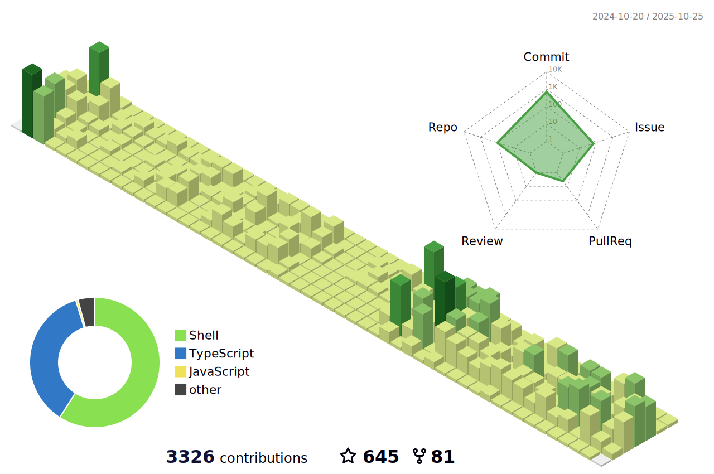

📢 Nominate ([@idimetrix](https://github.com/idimetrix/)) as **[GitHub Star](https://stars.github.com/nominate)**. If you appreciate his hard work and dedication to open source.

<a href="https://www.linkedin.com/in/dimetrix" target="_blank"></a>
[**[Hire A Talent](https://tally.so/r/3lldZB)**]
[**[Request A Quote](https://tally.so/r/3lldZB)**]
[**[Find Jobs](https://tally.so/r/3j9Qza)**] \_\_\_
[**[For Companies](https://tally.so/r/3lldZB)**]
[**[For Developers](https://tally.so/r/3j9Qza)**]

[**[Chat With Me](https://www.linkedin.com/in/dimetrix)**]
[**[Work With Me](https://www.linkedin.com/in/dimetrix)**]
[**[Newsletters](https://idimetrix.substack.com)**]

<p align="center">
<a href="https://tally.so/r/3lldZB" target="_blank"></a>
<a href="https://tally.so/r/3lldZB" target="_blank"></a>
<a href="https://tally.so/r/3j9Qza" target="_blank"></a>
</p>
<p align="center">
<a href="https://tally.so/r/3j9Qza" target="_blank"></a>
<a href="https://tally.so/r/3j9Qza" target="_blank"></a>
<a href="https://tally.so/r/3j9Qza" target="_blank"></a>
</p>
<p align="center">
<a href="https://tally.so/r/3j9Qza" target="_blank"></a>
<a href="https://tally.so/r/3j9Qza" target="_blank"></a>
<a href="https://tally.so/r/3j9Qza" target="_blank"></a>
</p>

[**[My CV - Build CV](https://github.com/idimetrix/cv)**]
[**[My README - Build README](https://github.com/idimetrix/idimetrix)**]
[**[My WEBSITE - Build WEBSITE](https://github.com/idimetrix/idimetrix.github.io)**]

---

[](https://stars.github.com/nominate)

---

#  Hello, my name is Dmitry (Di).

**Project Status:**  
<a href="https://github.com/idimetrix/idimetrix"></a>
<a href="https://github.com/idimetrix/idimetrix/graphs/contributors"></a>
<a href="https://github.com/idimetrix/idimetrix/stargazers"></a>
<a href="https://github.com/idimetrix/idimetrix/network/members"></a>

**Technology:**  


**Metrics:**  


I am 🧙 Lead Full-Stack Software Engineer and 🏆 Open Source lover

Welcome to my page; on my Github, you can find:

- Projects created by me
- Projects contributed by me

## 📑 Table of Contents

- [📬 Contact & Social](#-contact--social)
- [📊 Github Stats](#github-stats)
- [🔖 Featured Repositories](#-featured-repositories)
- [💼 Personal Stats](#personal-stats)
- [💻 Technology Stack](#-primary-technology-stack)
- [📊 GitHub Activity Graph](#-github-activity-graph)
- [🚀 Quick Setup](#-quick-setup)
- [📄 License](#mit)

---

## 📬 Contact & Social

<p align="center">
<a href="mailto:selikhov.dmitrey@gmail.com"></a>
<a href="https://x.com/idimetrix"></a>
<a href="https://www.linkedin.com/in/dimetrix/"></a>
<a href="https://t.me/idimetrix"></a>
<a href="https://dmitrii-selikhov.vercel.app/"></a>
</p>

<p align="center"><em>I am open to new opportunities and collaborations.</em></p>

## Github stats:

 
 

## 🔖 Featured repositories:

[](https://github.com/idimetrix/idimetrix)
[](https://github.com/idimetrix/cv)
[](https://github.com/idimetrix/awesome-talents)
[](https://github.com/idimetrix/awesome-job-boards)

---

## Personal Stats

### Professional Summary

With over 15 years of experience and 7+ years of education in Computer Science, a Lead Full-Stack Software Engineer specializes in designing and developing web applications. Skilled in JavaScript frameworks like React, Vue, Svelte, Stencil, and Angular, and proficient with back-end technologies such as Node, Go, and Rust, this role focuses on creating scalable, efficient, and secure applications.

<details>
  <summary>Highlights / Proficiencies / Interests / Believes</summary>

Highlights:

- ⭐ 15+ years of professional experience in full lifecycle development (web2/web3)
- ⭐ 7+ years of leadership positions (Technical Lead, Technical Architect, CTO/CEO)
- ⭐ Delivered over 50+ projects
- ⭐ Worked with over 25+ companies from startup to enterprise level
- ⭐ Mentoring over 150+ individuals on how to grow their technical and leadership skills
- ⭐ Co-founder and co-creator of 5 Web2 and 3 Web3 projects
- ⭐ Web2 and Web3 expert, I specialize in facilitating the seamless transition from Web2 to Web3 technologies.
- ⭐ Worked on innovative and cutting-edge projects
- ⭐ Contribute to industry thought leadership
- ⭐ Contribute to open source and private source
- ⭐ Master new technologies, computer science, and mathematics

Proficiencies:

- 📚 JavaScript, TypeScript, Node.js with Serverless and Containers and Microservices architecture
- 📚 React.js + Next.js + SSR/CSR + Prisma + Vercel
- 📚 Vue.js + Nuxt.js + SSR/CSR + TypeOrm + Cloudflare
- 📚 Angular, RxJS, NgRx
- 📚 Svelte and Stencil + Storybook + Web Components
- 📚 SQL and NoSQL databases (MySQL, PostgreSQL, MongoDB, DynamoDB, Redis)
- 📚 AWS, Azure and GCP
- 📚 Go lang, Move lang, Rust
- 📚 HTML5/CSS3 + Canvas + WebGL + Animation
- 📚 Agile, Scrum, Kanban
- 📚 Web2/Web3 startups
- 📚 Cryptography (cryptocurrency and blockchain)
- 📚 Team Leadership
- 📚 Project Leadership

Interests:

- ✔️ Self-education and self-development: Continuously seek opportunities for personal growth, self-improvement, and acquiring new knowledge and skills to stay at the forefront of industry trends and advancements.
- ✔️ Family: Place great importance on nurturing and cherishing family bonds, fostering strong relationships, and maintaining a healthy work-life balance to support personal well-being and fulfillment.
- ✔️ Sport (gym, padel tennis, crossfit): Engage in physical activities such as gym workouts, padel tennis, and crossfit, recognizing the importance of maintaining an active and healthy lifestyle to enhance productivity, focus, and overall well-being.

Big believer in:

- 💡 Power of continuous learning and personal growth
- 💡 Importance of cultivating a positive mindset and embracing optimism
- 💡 Value of hard work and perseverance in achieving success
- 💡 Power of empathy and kindness in fostering meaningful connections and creating a harmonious society
- 💡 Importance of ethical behavior and integrity in all aspects of life

</details>

## 💻 Technology Stack

### Languages


### Frontend Frameworks & Libraries


### UI Libraries & Styling


### Backend & APIs


### Databases & Caching


### Web3 & Blockchain


### Cloud & DevOps


### Testing & QA


### Monitoring & Analytics


### Build Tools & Package Managers


### Version Control & CI/CD


### CMS & Content Platforms


### Development Tools & IDEs


---

## Thanks for visiting

<p align="center">Thank you for checking out my profile! Feel free to explore my projects and connect with me.</p>

## Star History

[](https://star-history.com/#idimetrix/idimetrix&Date)

---

<details>
<summary>🎮 Interactive Game - Try pressing the buttons!</summary>

<p>Use the arrow keys and A/B buttons below (they connect to my LinkedIn profile)</p>

<div>
  <a href="https://www.linkedin.com/in/dimetrix" target="_blank">
  
 </a>
  <br />
  <br />
  <a href="https://www.linkedin.com/in/dimetrix?button=2&callback=https://github.com/idimetrix" target="_blank">
    
  </a>
  <br />
  <a href="https://www.linkedin.com/in/dimetrix?button=1&callback=https://github.com/idimetrix" target="_blank"></a>
  
  <a href="https://www.linkedin.com/in/dimetrix?button=0&callback=https://github.com/idimetrix" target="_blank"></a>
  
  
  <a href="https://www.linkedin.com/in/dimetrix?button=5&callback=https://github.com/idimetrix" target="_blank"></a>
  <a href="https://www.linkedin.com/in/dimetrix?button=4&callback=https://github.com/idimetrix" target="_blank"></a> <br />
  <a href="https://www.linkedin.com/in/dimetrix?button=3&callback=https://github.com/idimetrix" target="_blank">
    
  </a>
  <br />
  
  <a href="https://www.linkedin.com/in/dimetrix?button=6&callback=https://github.com/idimetrix" target="_blank"></a>
  <a href="https://www.linkedin.com/in/dimetrix?button=7&callback=https://github.com/idimetrix" target="_blank"></a>
</div>

</details>

<!--   GitHub stats graph -->

### 📈 GitHub Activity Graph:

<!--   green snake -->


<!--   stats + languages -->

| .                                                                                                                                                 | .                                                                                                                                  |
| ------------------------------------------------------------------------------------------------------------------------------------------------- | ---------------------------------------------------------------------------------------------------------------------------------- |
|  |  |

<!--   profile-green-animate -->



<!--   grid-snake  -->

<h4 align="center">🏆 Trophy: Github Profile Trophy</h4>

<p align="center"> 
<a href="https://github.com/ryo-ma/github-profile-trophy"></a>
</p>

## 🤖 Machine Learning Expertise

Experienced in the full machine learning lifecycle, from data collection to production deployment:


## 📍 Location

**Based in New York** - Working remotely with global teams across all time zones.

<!-- New York Geographic Area -->

```geojson
{
  "type": "FeatureCollection",
  "features": [
    {
      "type": "Feature",
      "id": 1,
      "properties": {
        "ID": 0,
        "name": "New York Metropolitan Area"
      },
      "geometry": {
        "type": "Polygon",
        "coordinates": [
          [
            [
              -74.2591,
              40.4774
            ],
            [
              -73.7004,
              40.9176
            ]
          ]
        ]
      }
    }
  ]
}
```

[MIT](LICENSE)

---

## 🚀 Quick Setup

This project uses **pnpm** for package management. Make sure you have it installed:

```bash
# Install pnpm globally
npm install -g pnpm

# Clone the repository
git clone https://github.com/idimetrix/idimetrix.git
cd idimetrix

# Install dependencies
pnpm install

# Format code
pnpm run format
```

### 🔧 Troubleshooting

If you encounter issues:

- **Check Node.js version**: Ensure you have Node.js v22 or higher
  ```bash
  node --version
  ```
- **Clear pnpm cache**: If dependencies fail to install
  ```bash
  pnpm store prune
  ```
- **Fresh install**: Remove node_modules and reinstall
  ```bash
  rm -rf node_modules pnpm-lock.yaml
  pnpm install
  ```
- **Windows users**: Use Git Bash or WSL for best compatibility

### 📁 Project Structure

```
.
├── .github/            # GitHub Actions workflows & configs
├── .vscode/            # VSCode workspace settings
├── images/             # Assets, banners, and graphics
├── profile-3d-contrib/ # 3D contribution visualizations
├── bash/               # Utility scripts
├── package.json        # Project metadata & dependencies
├── pnpm-lock.yaml      # Dependency lock file
└── README.md           # This file
```

For more details, see [CONTRIBUTING.md](CONTRIBUTING.md)

---

## 💬 Let's Connect

If you liked my profile, you can **Star ⭐** the repo and if you want to use this template you can **Fork** it!

**Interested in collaboration?** I'm open to:

- Contributing to open source projects
- Technical discussions and consulting
- Speaking engagements
- Mentorship opportunities

Feel free to submit PRs, issues, or email me. For meetings, please describe the agenda in advance.

---

## 🤝 Community

<p align="center">Join our <a href="https://github.com/elevanceit/.github/issues/new?assignees=&labels=invite+me+to+the+organisation&template=invitation.yml&title=Please+invite+me+to+the+GitHub+Organization">GitHub Organization :octocat:</a> and continue to contribute to our Open Source Software ✨</p>

<p align="center">
  <strong>I follow back all genuine contributors and collaborators. I value meaningful connections and active engagement in the developer community.</strong>
</p>


```TypeScript
// Check if the code is functioning correctly

// Let's ensure the code is the epitome of excellence
if (isCodeWorking) {
    console.log("✨ Code works! Time to polish it until it shines.");
    // Perfection is our destination, so onward we go!
    while (codeQuality < perfection) {
        codeQuality++; // Increment the code quality score
        console.log(`Improving... Code quality now at ${codeQuality}.`);
    }
    console.log("🏆 Code has reached perfection!");
}

// The cycle of life: eat, sleep, repeat
while (alive) {
    eat();
    sleep();
    console.log("Repeat! Because life is a loop. 🍕💤🔁");
}

// - Dmitry Selikhov
```

## 🎨 ASCII Art

[//]: # "https://www.asciiart.eu/image-to-ascii"

```
░░░░░░░░░░░░░░░░░░░░░░░░░░░░░░░░░░░░░░░░░░░░░░░░░░░░░░░░░░░░░░░░░░░░░░░░░░░
░░░░░░░░░░░░░░░░░░░░░░░░░░░░░░░░░░░░░░░░░░░░░░░░░░░░░░░░░░░░░░░░░░░░░░░░░░░
░░░░░░░░░░░░░░░░░░░░░░░░░░░░░░░░▒▒▒▒▒▒▒▒▒▒▒░░░░░░░░░░░░░░░░░░░░░░░░░░░░░░░░
░░░░░░░░░░░░░░░░░░░░░░░░░░░░▒▒▒▓▓██████████▓▓▓▒▒░░░░░░░░░░░░░░░░░░░░░░░░░░░
░░░░░░░░░░░░░░░░░░░░░░▒▒▒▒▒▓▓██▓▓▓██████████▓▓▓▓▓▒▒░░░░░░░░░░░░░░░░░░░░░░░░
░░░░░░░░░░░░░░░░░░░░░▒▓▓▓▓▓▓▓▓▓▓▓██████████▓█▓▓▓▓▓▓▒▒▒░░░░░░░░░░░░░░░░░░░░░
░░░░░░░░░░░░░░░░░░░▒▒████▓▓▓▓▓▓▓▓██▓▓▓▓▓▓▓▓▓▓▓▓▓▓▓▓▒▓▓▒▒░░░░░░░░░░░░░░░░░░░
░░░░░░░░░░░░░░░░░░▒▓█████▓▓▓▒▒▓▓▓▓▓▓▓▓▓▓▓▓▓▓▓▓▓▓▓▓▓▓▓▓█▓▓▒░░░░░░░░░░░░░░░░░
░░░░░░░░░░░░░░░░░▒▓█████▓▓▒▒▒░▒▒▒▒▒▒▒▒▒▒▒▒▒▒▒▒▒▒▒▒▒▓▓▓███▓▒░░░░░░░░░░░░░░░░
░░░░░░░░░░░░░░░░▒█████▓▒▒▒░░░░░░░░░░░░░░░░░░░░░░░░▒▒▒▒▓▓█▓▓▒░░░░░░░░░░░░░░░
░░░░░░░░░░░░░░░▒▓███▓▓▒▒▒▒░░░░░░░░░░░░░░░░░░░░░░░░░░▒▒▒▓████▒░░░░░░░░░░░░░░
░░░░░░░░░░░░░░░▒▓▓▓▓▓▒▒▒▒▒░░░░░░░░░░░░░░░░░░░░░░░░░░░▒▒▒▓▓██▒░░░░░░░░░░░░░░
░░░░░░░░░░░░░░░▒▓▓▓▓▓▒▒▒▒▒░░░░░░░░░░░░░░░░░░░░░░░░░░░▒▒▒▒▓██▓░░░░░░░░░░░░░░
░░░░░░░░░░░░░░░▒▓▓▓▓▓▒▒▒▒▒░░░░░░░░░░░░░░░░░░░░░░░░░░░▒▒▒▒▓▓▓▓░░░░░░░░░░░░░░
░░░░░░░░░░░░░░░▒▓▓▓▓▒▒▒▒▒▒░░░░░░░░░░░░░░░░░░░░░░░░░░░▒▒▒▒▓▓▓▓▒░░░░░░░░░░░░░
░░░░░░░░░░░░░░░▒█▓▓▓▒▒▒▒▒▒▒▒▒▒░░░░░░░░░░░░░░░░░░░░░░░▒▒▒▒▒▓▓▓▒░░░░░░░░░░░░░
░░░░░░░░░░░░░░░▒█▓▓▒▒▒▒▒▒▓▓▓▓▓▓▓▓▓▓▒░░░░░░░░▒▒▒▓▓▓▓▓▓▓▒▒▒▒▓▓▓▒░░░░░░░░░░░░░
░░░░░░░░░░░░░░░▒▓▓▓▒▒▒▒▒▓▓▒▒▒▒▒▒▓▓▓▒▒▒▒░░░▒▒▒▓▓▓▓▓▓▓▓▓▓▓▒▒▒▓▓░░░░░░░░░░░░░░
░░░░░░░░░░░░░░▒▒▒▓▓▒▒▒▒▒▒▒▓▓▓███▓▓▓▓▓▒░░░▒▒▓▓▓▓▓▓▒▒▒▒▒▓▒▒▒▒▓▒░░░░░░░░░░░░░░
░░░░░░░░░░░░░░▒▓▒▒▒▒▒▒░▒▒▒▒▒▒▓▓▓▒▒▓▓▒▒░░░▒▓▓▓▓▓███▓▓▓▓▒▒▒▒▒▓▒░░░░░░░░░░░░░░
░░░░░░░░░░░░░░▒▒▒▒▒▒▒░░░░░░▒▒▒▒▒▒▒▒▒▒▒░░░▒▒▒▒▒▒▒▒▒▒▒▒▒▒▒▒▒▒▒▒▒░░░░░░░░░░░░░
░░░░░░░░░░░░░░▒▒▒▒▒▒▒░░░░░░░░░░░░░░░▒░░░░▒▒░░░░▒▒▒▒▒░░░░░▒▒▒▒▒░░░░░░░░░░░░░
░░░░░░░░░░░░░░░▒▒▒▒▒▒▒░░░░░░░░░░░░░▒▒░░░░░▒▒░░░░░░░░░░░░░▒▒▒▒░░░░░░░░░░░░░░
░░░░░░░░░░░░░░▒░░▒▒▒▒▒▒░░░░░░░░░░░▒▒░░░░░░▒▒░░░░░░░░░░░░▒▒▒▒▒░░░░░░░░░░░░░░
░░░░░░░░░░░░░░▒▒▒▒▒▒▒▒▒▒░░░░░░░░░░▒▒▒▒▒▒▒▒▒▒▒░░░░░░░░░░▒▒▒▒▒▒░░░░░░░░░░░░░░
░░░░░░░░░░░░░░▒▒▒▒▒▒▒▒▒▒▒░░░░░░░░░▒▒▓▓▒▒▓▓▓▒▒░░░░░░░░▒▒▒▒▒▒▒▒░░░░░░░░░░░░░░
░░░░░░░░░░░░░░░▒▒▒▒▒▒▒▒▒▒░░░░░░░░░▒▒▒▒▒▒▒▒▒▒░░░░░░░░▒▒▒▒▒▓▒▒░░░░░░░░░░░░░░░
░░░░░░░░░░░░░░░░░▒▒▒▒▒▒▒▒▒░░░░░░░░░░░▒▒▒▒▒░░░░░░░░▒▒▒▒▒▒▒▒▒▒░░░░░░░░░░░░░░░
░░░░░░░░░░░░░░░░░▒▓▒▒▒▒░░▒░░░░▒▒▒▒▓▓▒▒▒▒▒▒▒▒▒░░░▒▒▒▒▒▒▒▒▒▒▒▒░░░░░░░░░░░░░░░
░░░░░░░░░░░░░░░░░▒▓▒▒▒▒░░░░░░░░░▒▒▒▒░░░▒▒▒▒▓▓▓▒▒▒░▒▒▒▒▒▒▒▒░░░░░░░░░░░░░░░░░
░░░░░░░░░░░░░░░░░▒▓▒▒▒▒▒░░░░░░░░░▒▒▒▒▒▒▒▒▒▒▒▒▒░▒░░▒▒▒▒▒▒▒▒░░░░░░░░░░░░░░░░░
░░░░░░░░░░░░░░░░░░▒▒▒▒▒▒░░░░░░░░░░░▒▒▒▒▒▒▒▒▒▒▒░░░▒▒▒▒▒▒▒▒░░░░░░░░░░░░░░░░░░
░░░░░░░░░░░░░░░░░░▒▒▒▒▒▒▒▒░░░░░░░░░░░░░░░░░░░░░░░▒▒▒▒▒▒▒░░░░░░░░░░░░░░░░░░░
░░░░░░░░░░░░░░░░░░▒▒▒▒▒▒▒▒▒▒▒▒▒▒░░░░░░░░░░░░░░▒▒▒▒▒▒▒▒▒░░░░░░░░░░░░░░░░░░░░
░░░░░░░░░░░░░░░░▒▒▒▒▒▒▒▒▒▒▒▒▒▒▒▒▒▒▒▒▒▒▒▒▒▒▒▒▒▒▒▒▒▒▒▒▒▒░░░░░░░░░░░░░░░░░░░░░
░░░░░░░░░░░░░░▒▒▒▒▒▒▒▒▒▒▒▒▒▒▒▒▒▒▒▒▒▒▒▒▒▒▒▒▒▒▒▒▒▒▒▒▒▒▒▒░░░░░░░░░░░░░░░░░░░░░
░░░░░░░░░░░░░░▒▒▓▒▒▒▒▒▒▒▒▒▒▒▒▒▒▒▒▒▒▒▒▒▒▒▒▒▒▒▒▒▒▒▒▒▒▒▒▒░░░░░░░░░░░░░░░░░░░░░
░░░░░░░░░░░░░░▒▓▓▒▒▒▒▒▒▒▒▒▒▒▒▒▒▒▒▒▒▒▒▒▒▒▒▒▒▒▒▒▒▒▒▒▒▒▒░░░░░░░░░░░░░░░░░░░░░░
░░░░░░░░░░░░░░▓▓▒▒▒▒▒▒▒▒▒▒▒▒▒▒▒▒▒▒▒▒▒▒▒▒▒▒▒▒▒▒▒▒▒▒▒▒░░░░░░░░░░░░░░░░░░░░░░░
░░░░░░░░░░░░░░▒▒▒▒▒▒░░░░░░▒▒▒▒▒▒▒▒▒▒▒▒▒▒▒▒▒▒▒▒▒▒▒▒▒░░░░░░░░░░░░░░░░░░░░░░░░
░░░░░░░░░░░░░░░▒▒▒▒▒▒░░░░░░░░▒▒▒▒▒▒▒▒▒▒▒▒▒▒▒▒▒▒▒▒▒▒░░░░░░░░░░░░░░░░░░░░░░░░
```

## 📊 Advanced Repository Analytics (OSS Insight)

| Star Geographic Distribution                                                                                                                                                       | Star History                                                                                                                                                  |
| ---------------------------------------------------------------------------------------------------------------------------------------------------------------------------------- | ------------------------------------------------------------------------------------------------------------------------------------------------------------- |
|  |  |

| Currently Working On - Last 28 days                                                                                                                                                | Top Active Contributors - Last 28 Days                                                                                                                           |
| ---------------------------------------------------------------------------------------------------------------------------------------------------------------------------------- | ---------------------------------------------------------------------------------------------------------------------------------------------------------------- |
|  |  |

---
